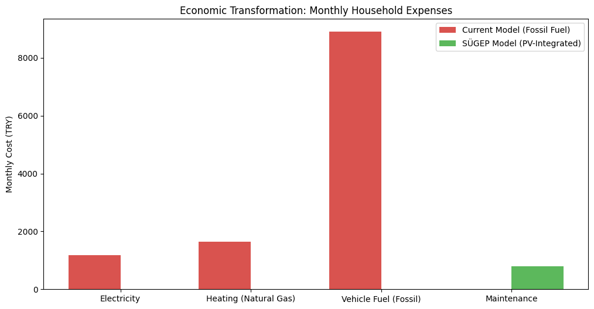
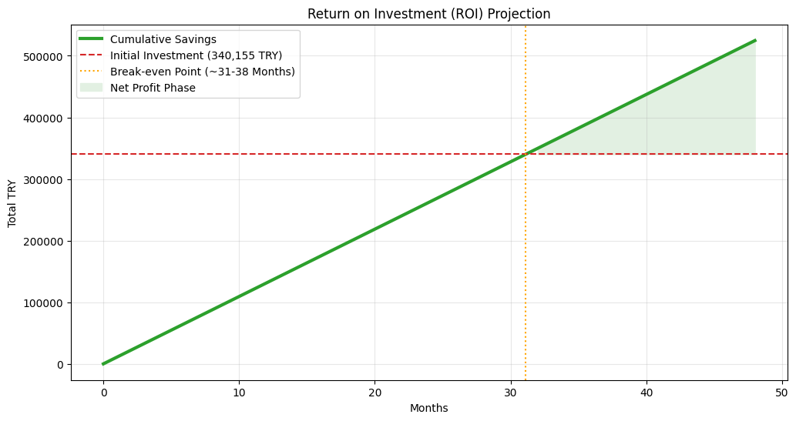

# Photovoltaic-Energy-Self-Sufficient-Buildings-Policy-Framework
An engineering-economic policy framework for energy-independent cities. Integrating data modelling with legislative advocacy in the Turkish Grand National Assembly (TBMM). From fieldwork analyses to a formal national bill.

---

## The Quick Core Metrics (Impact at a Glance)
Before diving into the code and legal frameworks, here is the real-world scale of this student-led research journey:
* **Government Level:** Formally drafted and submitted as a legislative proposal to the Parliamentary Environment Committee (TBMM).
* **Financial Viability:** Proven **31-38 months ROI** for residential PV integration, breaking even faster than traditional green investments.
* **Public Mobilization:** Organized a grassroots campaign gathering **5,000+ verified signatures** to demonstrate public demand.
* **Field Study:** Data collection and research by an on-site case study of the LEED Platinum TMB Headquarters and covered by major national news networks.

---

## Economic Impact & ROI Analysis

Our model demonstrates a radical shift in household economics. By transitioning to PV-integrated systems, the monthly energy burden is replaced by a high-efficiency investment.

### 1. Monthly Expense Transformation

*The SÜGEP model effectively eliminates major utility bills (electricity, heating, and fuel), replacing them with a minimal maintenance fee.*

### 2. Investment Recovery Timeline

*With a monthly net saving of 10,930 TRY, the initial investment is recovered in approximately 31-38 months, after which the system provides pure financial gain to the household.*
